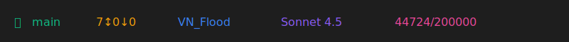

# My Claude Statusline Configuration

A comprehensive statusline configuration for [Claude Code](https://claude.com/claude-code) that displays git information, project details, model info, and token usage.

## Features

- **Git Branch**: Shows the current git branch with a branch icon
- **Git Status**: Displays uncommitted changes, commits ahead/behind remote
- **Current Directory**: Shows the current project/directory name
- **Model Information**: Displays the active Claude model
- **Token Usage**: Shows conversation token usage and remaining budget

## Preview



The statusline displays information in this format:
```
 main  7↕0↓0  VN_Flood  Sonnet 4.5  44724/200000
```

**Breakdown**:
- ` main` = Git branch (green)
- ` 7↕0↓0` = 7 uncommitted changes, 0 commits ahead, 0 behind (amber)
- ` VN_Flood` = Current directory name (blue)
- ` Sonnet 4.5` = Active Claude model (purple)
- ` 44724/200000` = Tokens used / total budget (pink)

## Installation

### Method 1: Copy to Claude Config Directory

```bash
# Copy the statusline.json to your Claude config directory
cp statusline.json ~/.claude/statusline.json
```

### Method 2: Symlink (Recommended)

```bash
# Create a symlink to keep your config in sync with updates
ln -sf "$(pwd)/statusline.json" ~/.claude/statusline.json
```

### Method 3: Manual Copy

Copy the contents of `statusline.json` to `~/.claude/statusline.json` manually.

## Verification

After installation, restart Claude Code or run:
```bash
claude
```

Your statusline should now display at the bottom of the terminal with all configured information.

## Customization

### Colors

The configuration uses hex color codes for each segment. You can customize these in the `statusline.json` file:

- `git_branch`: `#10b981` (green)
- `git_status`: `#f59e0b` (amber)
- `directory`: `#3b82f6` (blue)
- `model`: `#8b5cf6` (purple)
- `tokens`: `#ec4899` (pink)

### Icons

The configuration uses Nerd Font icons. Ensure your terminal uses a [Nerd Font](https://www.nerdfonts.com/) for proper icon display:
-  = Git branch icon
-  = File changes icon
-  = Folder icon
-  = Model/chip icon
-  = Token/flame icon

### Format

You can modify the `format` field to change the order or add/remove segments:

```json
{
  "format": "{git_branch}{git_status} {directory} {model} {tokens}"
}
```

### Adding New Segments

Create new segments in the `segments` object following this structure:

```json
"segment_name": {
  "template": " {value}",
  "value": "{{variable.name}}",
  "color": "#hexcolor",
  "show_when": "{{condition}}"
}
```

## Available Variables

Claude Code provides these template variables:

- `{{git.branch}}` - Current git branch
- `{{git.in_repo}}` - Boolean: in a git repository
- `{{git.uncommitted_changes}}` - Number of uncommitted changes
- `{{git.ahead}}` - Commits ahead of remote
- `{{git.behind}}` - Commits behind remote
- `{{git.has_changes}}` - Boolean: has uncommitted changes or ahead/behind
- `{{cwd.basename}}` - Current directory name
- `{{cwd.path}}` - Full current directory path
- `{{model.name}}` - Active Claude model name
- `{{model.id}}` - Model identifier
- `{{tokens.used}}` - Tokens used in conversation
- `{{tokens.budget}}` - Total token budget

## Requirements

- [Claude Code](https://claude.com/claude-code) CLI
- Terminal with [Nerd Font](https://www.nerdfonts.com/) support (optional, for icons)

## Troubleshooting

### Icons not displaying

Install a Nerd Font and configure your terminal to use it:
- [Nerd Fonts Download](https://www.nerdfonts.com/)
- Popular choices: FiraCode Nerd Font, JetBrains Mono Nerd Font, Hack Nerd Font

### Statusline not appearing

1. Verify the file exists: `ls -la ~/.claude/statusline.json`
2. Check JSON syntax: `cat ~/.claude/statusline.json | python3 -m json.tool`
3. Restart Claude Code

### Git information not showing

Ensure you're in a git repository: `git status`

## License

MIT License - feel free to use and modify as needed.

## Contributing

Feel free to open issues or pull requests with improvements!

## Resources

- [Claude Code Documentation](https://claude.com/claude-code)
- [Nerd Fonts](https://www.nerdfonts.com/)
