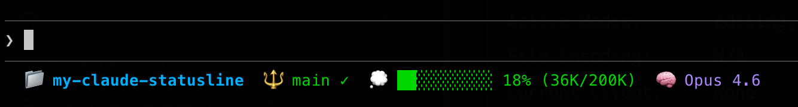

# My Claude Statusline

A beautiful statusline for [Claude Code](https://claude.com/claude-code) showing git branch, directory, model, and token usage.

## Preview



## Install

**Copy and paste this into Claude Code:**

```
Install statusline: download https://raw.githubusercontent.com/nguyentran4896/my-claude-statusline/main/statusline.json to ~/.claude/statusline.json and configure ~/.claude/settings.json if needed
```

Claude will automatically download and configure everything.

## What You Get

- 📁 **Directory** - Current project name
- 🔱 **Git Branch** - Branch with status indicator
- 🟩 **Token Usage** - Progress bar with percentage
- 🧠 **Model** - Active Claude model

## Customize

After installation, edit `~/.claude/statusline.json` to change colors:

- `git_branch`: `#10b981` (green)
- `git_status`: `#f59e0b` (amber)
- `directory`: `#3b82f6` (blue)
- `model`: `#8b5cf6` (purple)
- `tokens`: `#ec4899` (pink)

## License

MIT
