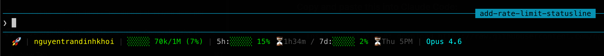

# Claude Code Statusline

Beautiful, information-dense statusline for [Claude Code](https://claude.com/claude-code) with rate limits, git info, token usage, and more.

## Preview



## Features

- **Plan icon** — customizable emoji (default: ⚡)
- **Project name** — current working directory
- **Git info** — branch, dirty/clean status, ahead/behind counts
- **Token usage** — colored progress bar with percentage and context size
- **Rate limits** — 5-hour session + 7-day weekly usage with countdown timers (shown when available)
- **Model** — current Claude model and version (Opus, Sonnet, Haiku)
- **Output style** — shown when non-default

## Requirements

- [Claude Code](https://docs.anthropic.com/en/docs/claude-code) (v2.1.80+ for rate limits)
- `jq` — JSON parsing
- `bc` — floating-point token formatting
- `git` — git info segment (optional, segment is skipped if not in a repo)

## Install

**Option 1: Copy and paste this into Claude Code:**

```
Install statusline: download https://raw.githubusercontent.com/nguyentran4896/my-claude-statusline/main/statusline-template.sh to ~/.claude/statusline-cool.sh, make it executable, and configure ~/.claude/settings.json to use it
```

**Option 2: Manual install:**

```bash
curl -o ~/.claude/statusline-cool.sh \
  https://raw.githubusercontent.com/nguyentran4896/my-claude-statusline/main/statusline-template.sh
chmod +x ~/.claude/statusline-cool.sh
```

Then add to your `~/.claude/settings.json`:

```json
{
  "env": {
    "CLAUDE_CODE_STATUSLINE": "~/.claude/statusline-cool.sh"
  }
}
```

## Customize

All customizable options are at the top of the script under `✏️ CUSTOMIZE HERE`:

| Setting | Default | Description |
|---------|---------|-------------|
| `PLAN_ICON` | `⚡` | Emoji or short text shown as the first segment |
| `TOKEN_THRESH_*` | 30 / 60 / 80 | Color thresholds for token usage bar |
| `RATE_THRESH_*` | 50 / 75 / 90 | Color thresholds for rate limit bars |
| `BAR_WIDTH` | 5 | Number of block characters in progress bars |

Colors (ANSI 256) and the separator style can also be changed in the color section below the customization block.

### Rate limits

The rate limits segment shows your 5-hour session and 7-day weekly usage with colored progress bars and countdown timers until reset. It appears automatically after the first API call if your plan provides rate limit data.

Color progression: green → yellow → orange → red as usage increases.
